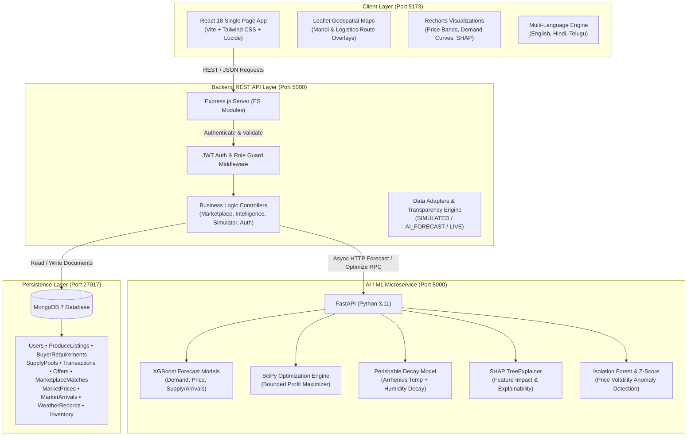
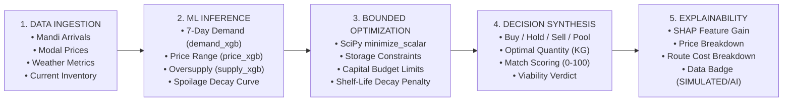
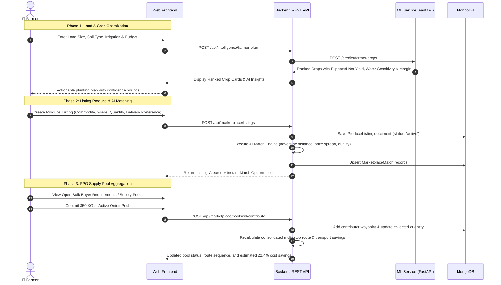
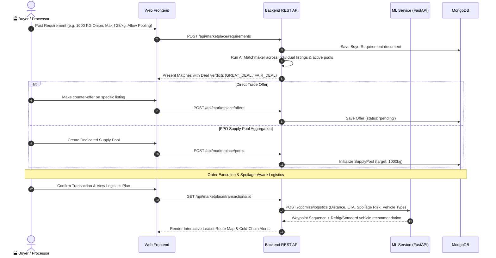
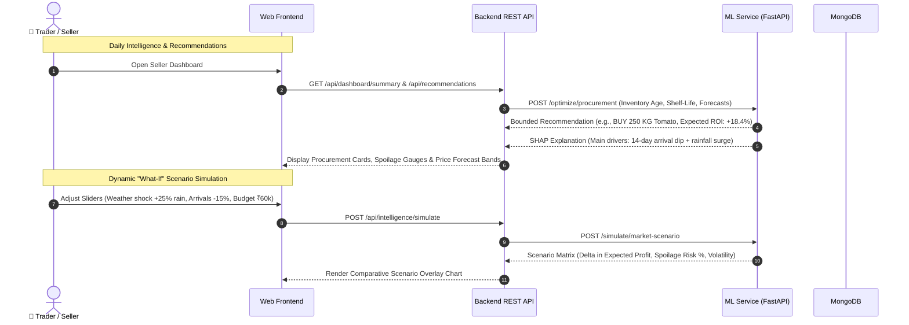
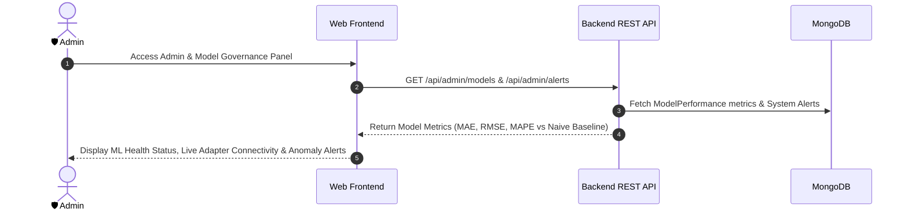
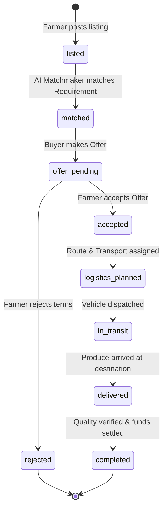
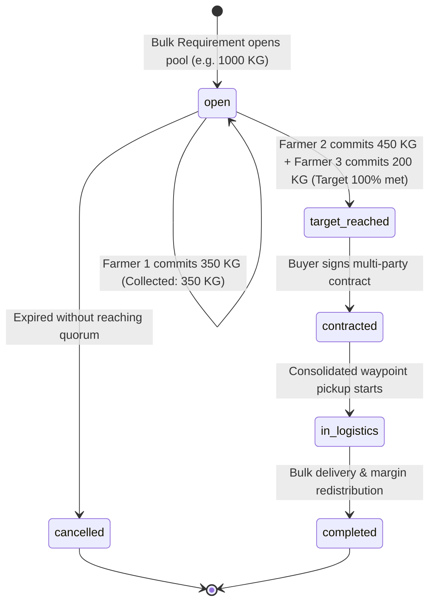
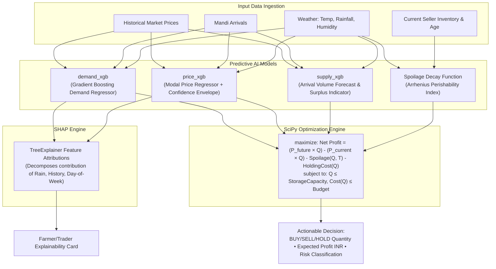
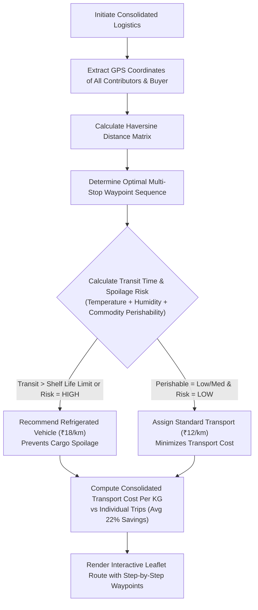

# MandiMind — End-to-End System Workflow & Architecture Blueprint

```
========================================================================================
           MANDIMIND — AI-POWERED AGRICULTURAL DEMAND, PRICE & MARKETPLACE
                          COMPREHENSIVE SYSTEM WORKFLOW
========================================================================================
```

MandiMind is an intelligent agricultural decision-support and direct marketplace platform designed for **Farmers**, **Agricultural Buyers/Processors**, **Traders/Sellers**, and **Market Administrators**.

---

## 1. High-Level System Architecture & Flow



---

## 2. End-to-End Product Pipeline

The core decision loop in MandiMind follows a 5-stage sequential intelligence pipeline:



---

## 3. Core Persona Workflows

### 3.1. Farmer Workflow: From Planning to Direct Sale & Aggregation



---

### 3.2. Buyer & Food Processor Workflow: Sourcing & Logistics Optimization



---

### 3.3. Trader & Seller Workflow: Procurement, Inventory & What-If Simulation



---

### 3.4. Administrator & Governance Workflow: ML Monitoring & Anomaly Detection



---

## 4. Transaction & Supply Pool State Machines

### 4.1. Direct Marketplace Transaction Lifecycle



### 4.2. FPO Multi-Farmer Supply Pool Aggregation Lifecycle



---

## 5. Machine Learning & Optimization Engines



---

## 6. Multi-Stop Logistics & Spoilage Mitigation Flow

When multiple farmers contribute to an FPO Supply Pool, the system optimizes both logistics economics and spoilage prevention:



---

## 7. Data Transparency & Verification Protocol

MandiMind maintains strict data accountability across all interfaces:

| Badge | Identifier | Definition & Protocol |
| :--- | :--- | :--- |
| <span style="background-color:#0284c7;color:white;padding:2px 8px;border-radius:4px;font-size:11px;font-weight:bold;">SIMULATED</span> | `SIMULATED` | Pre-seeded baseline demo series (clearly marked to avoid mistaking for real government mandis). |
| <span style="background-color:#7c3aed;color:white;padding:2px 8px;border-radius:4px;font-size:11px;font-weight:bold;">AI_FORECAST</span> | `AI_FORECAST` | Machine learning model outputs (`demand_xgb`, `price_xgb`, `supply_xgb`, SHAP values). |
| <span style="background-color:#d97706;color:white;padding:2px 8px;border-radius:4px;font-size:11px;font-weight:bold;">HISTORICAL</span> | `HISTORICAL` | Held-out validation and benchmark dataset metrics for tracking model accuracy (MAE, RMSE, MAPE). |
| <span style="background-color:#16a34a;color:white;padding:2px 8px;border-radius:4px;font-size:11px;font-weight:bold;">LIVE</span> | `LIVE` | Reserved exclusively for active external government API feeds (e-NAM / AGMARKNET) upon key configuration. |

---

## 8. Summary of Ports, Services & Docker Topology

```
+---------------------------------------------------------------------------------------+
|                                    DOCKER COMPOSE                                     |
|                                                                                       |
|   +-------------------+    +--------------------+    +----------------------------+   |
|   |   mandimind-web   |    |   mandimind-api    |    |        mandimind-ml        |   |
|   |     (Frontend)    |    |     (Backend)      |    |        (ML Service)        |   |
|   |     Port: 5173    |    |     Port: 5000     |    |         Port: 8000         |   |
|   |   React 18 + Vite |    |  Express + Node.js |    |      FastAPI + Python      |   |
|   +---------+---------+    +---------+----------+    +--------------+-------------+   |
|             |                        |                              |                 |
|             +-------- HTTP --------->+-------------- HTTP --------->+                 |
|                                      |                                                |
|                            +---------v----------+                                     |
|                            |  mandimind-mongo   |                                     |
|                            |    (DB Server)     |                                     |
|                            |    Port: 27017     |                                     |
|                            |      MongoDB 7     |                                     |
|                            +--------------------+                                     |
+---------------------------------------------------------------------------------------+
```
